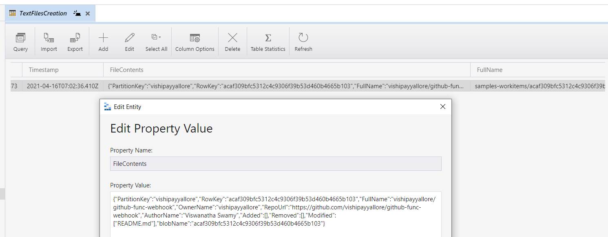

# Repository for Speaking Event of Global Azure 2021 - India 

> 1. Event Date: **17-Apr-2021**
> 1. Event URL: [Global Azure 2021 - India](https://gab2021.azurewebsites.net/)


----------------------------------------------------------------------------------------------------------------

## Pre-Requisites
> 1. .NET SDK
> 1. Azure Function Core Tools
> 1. Azure CLI
> 1. Azure Functions VS Code Extension

### Software/Tools
> 1. OS: win32 x64
> 1. Angular CLI: **11.2.7**
> 1. Node: **14.16.0**
> 1. Visual Studio Code
> 1. Visual Studio 2019

### Prior Knowledge
> 1. C#, Node JS
> 1. gRPC
> 1. Azure
> 1. Blazor WASM, Angular 11

### Assumptions
> 1. NIL

## Technology Stack
> 1. Azure Functions

## Information


----------------------------------------------------------------------------------------------------------------

## What are we doing today?
> 1. Introduction to Azure Functions
> 1. Creating Azure Functions in C#, and Node JS
> 1. Creating Azure Functions using multiple methods
> 1. Execute Azure Functions with triggers [Http, and Blob]
> 1. Execute Azure Functions with input/output bindings
> 1. Working with Durable Azure Functions
> 1. Monitoring Azure Functions with Application Insights
> 1. Deploying Azure Functions using Azure CLI
----------------------------------------------------------------------------------------------------------------


-----

## How to Build and Execute the solution

### **1. Introduction**

#### 1.1. Introduction to Azure Functions
Discussion

#### 1.2. Creating Azure Functions in C#, and Node JS
Discussion

-----

#### **2. Azure Functions in Portal using Node JS**
**Description:**

We will create a simple Azure Function App with node runtime. It will have a Http Trigger Azure Function which will accept "name, and data" as part of POST call. We will also add "lodash" package using Kudu Console.

**Steps:**
1. Create a Function App called "func-azportal-demo-dev-001"
1. Add a Function and code
1. Code and Test
1. Integration
1. Monitor
1. Storage Account Explorer
1. Kudu Console
1. Testing using Browser (GET)
1. Testing using Postman (POST)

##### **Images for Reference**
##### **Receiving Http Status Code 400 when we don't send the proper inputs to Azure Function**


##### **Receiving Http Status Code 200 when we send the proper inputs to Azure Function**


-----

#### **3. GitHub Webhook, Http Trigger, Blob Trigger, and Function Chaining using Core Tools with Node JS**

**Description:**

We will create a Azure function App using **Core Tools** with node runtime. It will have a A. Http Trigger, and B. Blob Trigger. We will also have a GitHub Webhook, which will post on any code changes to the repository. 

**A. GitCodeChangeTracker - Http Trigger**

When code is commited to the repository, GitHub Webhook will invoke **GitCodeChangeTracker** function. This function has two Output (Table, and Blob) bindings. We will store information into the Table, and Blob. It will trigger the **textfile-creation** function when the blob is created (**Function Chaining**).

**B. textfile-creation - Blob Trigger**
On Blob creation this function we be invoked. It has Table output binding and will log the blob creation. It will also store the content of the blob inside **FileContents** column of the Table.

**Steps:**
1. Verify the Azure Functions Core Tools on local Laptop.
1. Create the Azure Function project using **func init**
1. Create two (*GitCodeChangeTracker*, and *textfile-creation*) new functions with **func new**
1. Modify the code of both (*GitCodeChangeTracker*, and *textfile-creation*) azure functions. Please refer **StarterFiles** folder.
1. Verify functions locally **func start**. We use **Postman** for testing it locally.
1. **Debug** using Visual Studio Code.
1. Function App is already create using **az functionapp create** command
1. Publish the Function app to Azure using **func azure functionapp publish func-azcoretools-demo-dev-001**
1. Ensure to update the Function App with Table Storage Connection String

```
func version
func
func init
func new
func start
func azure functionapp publish func-azcoretools-demo-dev-001
```

##### **Images for Reference**

##### **Publishing Azure Functions using *func azure functionapp publish* command**


##### **GitHub Webhook invoking Http Trigger Azure Function**


##### **Http Trigger Function Storing the record in Table using Output binding**


##### **Http Trigger Function Storing the JSON file in blob using Output binding**


##### **Blob Trigger Function Storing the record in Table using Output binding**


-----

#### **4. APIs using Azure Functions in Visual Studio Code in C#**

**Description:**

We will create a Azure function App using **Core Tools** with node runtime. It will have a A. Http Trigger, and B. Blob Trigger. We will also have a GitHub Webhook, which will post on any code changes to the repository. 

-----

----------------------------------------------------------------------------------------------------------------

### **2. Creating Azure Functions using multiple methods**
We will be creating Azure Functions using A. Portal, B. Azure Functions Core Tools, C. Visual Studio Code, and D. Visual Studio

#### **D. Visual Studio using C#**
Demo

### **1. Execute Azure Functions with input/output bindings**
Demo

### **1. Monitoring Azure Functions with Application Insights**
Demo

### **1. Deploying Azure Functions using Azure CLI**
Demo

----------------------------------------------------------------------------------------------------------------

```
rg-globalaz2021-india-dev-001
cosmos-globalaz2021-india-dev-001
stglobalaz2021india001
func-azcoretools-demo-dev-001

func-vscode-demo-dev-001

stazcoretoolsdemo001
stvscodedemo001
stvs2019demo001
rg-globalaz2021-india-prod-001
```
- Storage Account
- Application Insights
- App Service Plan
