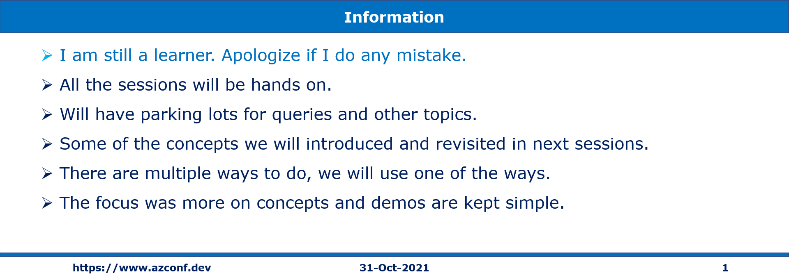
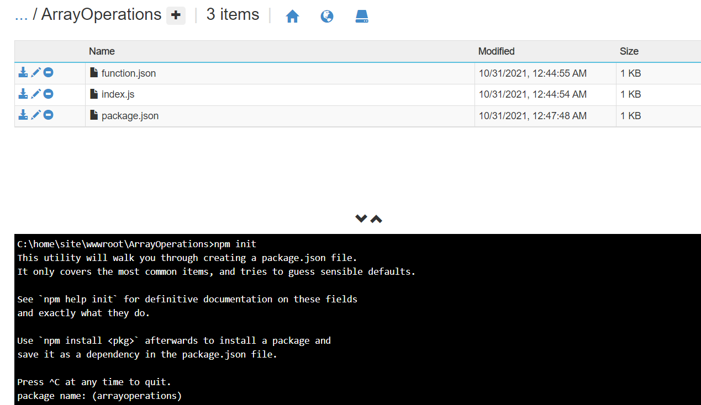
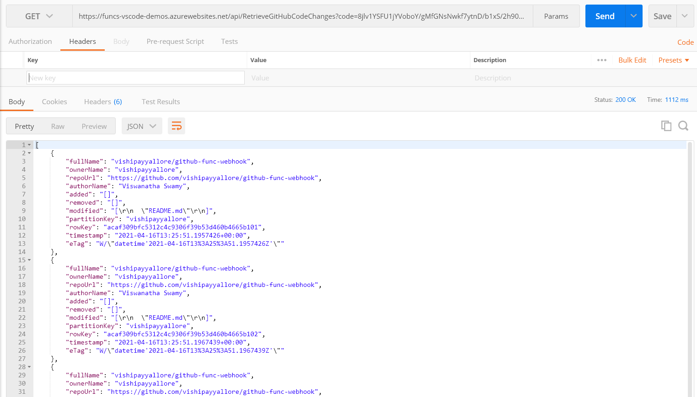

# Hands On Azure Functions Workshop on 31-Oct-2021 at 10:00 AM IST

## Event URL: [https://www.azconf.dev/](https://www.azconf.dev/)


---

## Pre-Requisites

> 1. .NET 5/6 SDK
> 1. Azure Function Core Tools
> 1. Azure CLI
> 1. Azure Functions VS Code Extension

### Software/Tools

> 1. OS: win32 x64
> 1. Node: **v14.17.5**
> 1. Visual Studio Code
> 1. Visual Studio 2019/2022

### Prior Knowledge

> 1. C#, Node JS
> 1. Azure Storage
> 1. Azure Functions
> 1. Blazor WASM

### Assumptions

> 1. NIL

## Technology Stack

> 1. Azure Functions

## Information

## 

## What are we doing today?

> 1. Introduction to Azure Functions
> 1. Creating Azure Functions using multiple methods
> 1. Creating Azure Functions in C#, and Node JS
> 1. Execute Azure Functions with triggers [Http, and Blob]
> 1. Execute Azure Functions with input/output bindings
> 1. Deploying Azure Functions using Azure CLI
> 1. APIs using Azure Functions in Visual Studio Code in C#
> 1. Retrieve GitHub Code Changes - HTTP Trigger
> 1. Blazor WASM Web App UI to display those changes.
> 1. Deploying the code to Azure
> 1. Monitoring Azure Functions with Application Insights

## One Hello World, One Warm up Project and Two Mini Projects

> 1. Hello World Project - Http, Timer, and Queue `Trigger` with Blob, and Queue `Input/Output Bindings`
> 1. Warm Up Project - Http Trigger - NodeJS - `ArrayOperations`
> 1. Mini Project 1 - GitHub Code Change Tracker
> 1. Mini Project 2 - Simple App with Azure Function & Blazor

---


---

## Introduction to Azure Functions

**Note:** Discussion

> 1. Faas (Function as a Service) is a service that allows you to create and run serverless functions on Azure.
> 1. Triggers: Http, Timer, Blob, Queue, ServiceBus, EventHub, etc.
> 1. Bindings: Input, Output, etc. (Queue, Blob, CosmosDb, ServiceBus, EventHub, etc.)
> 1. Hosting Models: Consumption Plan, App Service, Premium, Docker Container.
> 1. Environments: Azure Portal, VS 2019/2022, Azure Function Core tools, VS Code.
> 1. Security, Identify Provider Integration, Function Chaining, Durable Functions

URLs:
> 1. https://docs.microsoft.com/en-us/azure/azure-functions/functions-triggers-bindings?tabs=csharp

## Monitoring Azure Functions with Application Insights

**Note:** Hands ON

> 1. It will be ongoing activity throughout the workshop

## Creating Azure Functions using multiple methods

**Note:** Discussion

> 1. Create a new Azure Function App using Azure Portal
> 1. Create a new Azure Function App using Azure Function Core Tools
> 1. Create a new Azure Function App using Azure Functions VS Code Extension
> 1. Create a new Azure Function App using Visual Studio 2022

## Creating Azure Functions in C#, and Node JS

**Note:** Hands ON

> 1. Function App: One or more functions with common configuration, scale together
> 1. Creating `Hello World` Azure Function using C#
> 1. Creating `Hello World` Azure Function using Node JS


## Execute Azure Functions with triggers [Http, Timer and Queue]

**Note:** Hands ON

> 1. Creating Azure Function using Http Trigger
> 1. Creating Azure Function using Queue Trigger
> 1. Creating Azure Function using Timer Trigger

## Execute Azure Functions with input/output bindings

**Note:** Hands ON

> 1. Adding Blob output binding for the Http Trigger
> 1. Adding Blob output binding for the Queue Trigger. It has Queue as Input binding
> 1. Adding Queue output binding for the Timer Trigger

## Warm up Project - `ArrayOperations`

**Note:** Http Trigger | NodeJS | `ArrayOperations`

**Description:**

We will create a Azure Function App named **func-azportal-demo-dev-004** with node runtime. It will have a Http Trigger Azure Function which will accept "name, and data" as part of POST call. We will also add "lodash" package using Kudu Console.

**Steps:**
1. Create a Function App called "func-azportal-demo-dev-001"
1. Add a Function called **ArrayOperations**
1. Code and Test Tab
1. Testing using Browser (GET)
1. Integration Tab
1. Monitor Tab
1. Storage Account Explorer
1. Kudu Console
1. Testing using Postman (POST)

```
npm init -y
npm install lodash
```

**Note:** Images for Reference



**Receiving Http Status Code 400 when we don't send the proper inputs to Azure Function**


**Receiving Http Status Code 200 when we send the proper inputs to Azure Function**


## Mini Project 1 - `GitHub Code Change Tracker`
**Note:** 
> 1. Hands ON
> 1. Using Azure Function Core Tools
> 1. Using Azure Functions VS Code Extension

**Description:**

We will create a Azure function App **func-azcoretools-demo-dev-001** using **Core Tools** with node runtime. It will have a A. Http Trigger, and B. Blob Trigger azure functions. We will also have a GitHub Webhook, which will post any code changes to the repository.

**A. GitCodeChangeTracker - Http Trigger**

When code is commited to the repository, GitHub Webhook will invoke **GitCodeChangeTracker** function. This function has two (Table, and Blob) Output  bindings. We will store information into the Table, and Blob. It will trigger the `textfile-creation` function when the blob is created (`Function Chaining`).

**B. textfile-creation - Blob Trigger**
On Blob creation this function we be invoked. It has `Table` output binding and will log the blob creation. It will also store the content of the blob inside `FileContents` column of the Table.

**Steps:**

1. Verify the Azure Functions Core Tools on local Laptop.
1. Create the Azure Function project using **func init**
1. Create two (`GitCodeChangeTracker`, and `textfile-creation`) new functions with **func new**
1. Modify the code of both (`GitCodeChangeTracker`, and `textfile-creation`) azure functions. Please refer **StarterFiles** folder.
1. Verify functions locally **func start**. We use **Postman** for testing it locally.
1. **Debug** using Visual Studio Code.
1. Function App is already create using **az functionapp create** command
1. Publish the Function app to Azure using **func azure functionapp publish func-azcoretools-demo-dev-001**
1. Ensure to update the Function App with Table Storage Connection String

```
func version
func
func init
func new
func start
func azure functionapp publish func-azcoretools-demo-dev-001
```

##### **Images for Reference**

##### **Publishing Azure Functions using _func azure functionapp publish_ command**


##### **GitHub Webhook invoking Http Trigger Azure Function**


##### **Http Trigger Function Storing the record in Table using Output binding**


##### **Http Trigger Function Storing the JSON file in blob using Output binding**


##### **Blob Trigger Function Storing the record in Table using Output binding**


## Mini Project 2 - `Simple App with Azure Function & Blazor`

APIs using Azure Functions in Visual Studio Code in C#
Retrieve GitHub Code Changes - HTTP Trigger
Blazor WASM Web App UI to display those changes.
Deploying the code to Azure

---


---

#### **3. GitHub Webhook, Http Trigger, Blob Trigger, and Function Chaining using Core Tools with Node JS**


---

#### **4. APIs using Azure Functions in Visual Studio Code in C#**

**Description:**

We will create a Azure function App **func-vscode-demo-dev-001** using **Visual Studio Code** with dotnet runtime. It will have a A. Http Trigger auzre function. We will retrieve the GitHub Code Changes from Azure Table Storage. We have a Blazor WASM SPA application, which will invoke the Azure Function and display the content.

**A. RetrieveGitHubCodeChanges - Http Trigger**

It will retrieve the GitHub Code Changes from Azure Table Storage.

**B. Blazor WASM Web App**
We have a Blazor WASM SAP application, which will invoke the Azure Function and display the content.

**Steps:**

1. Create the Azure Function project using **VS Code**
1. Create _RetrieveGitHubCodeChanges_ new function
1. Modify the code of _RetrieveGitHubCodeChanges_ azure function. Please refer **StarterFiles** folder.
1. Verify functions locally **func start**. We use **Postman** for testing it locally.
1. **Debug** using Visual Studio Code.
1. Function App is already create using **az functionapp create** command
1. Publish the Function app to Azure using **VS Code**
1. Ensure to update the Function App with Table Storage Connection String
1. Ensure to update the CORS in the deployed Function App.

##### **Images for Reference**

##### **Publishing Azure Functions using _VS Code_ .**


##### **Retrieving Content using Postman**



##### **Integrating the Blazor WASM and Http Triggered Azure Function**


---

```
rg-globalaz2021-india-dev-001
cosmos-globalaz2021-india-dev-001
stglobalaz2021india001
func-azcoretools-demo-dev-001

func-vscode-demo-dev-001

stazcoretoolsdemo001
stvscodedemo001
stvs2019demo001
rg-globalaz2021-india-prod-001
```

-   Storage Account
-   Application Insights
-   App Service Plan

## Resource in Azure

func-azportal-demo-dev-001

rg-azconf-workshop-prod-001