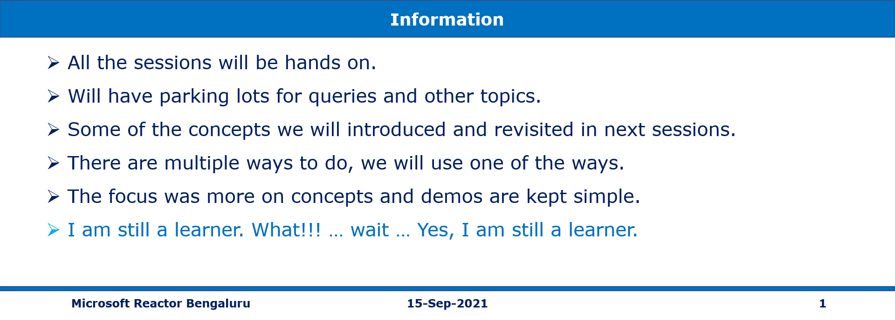
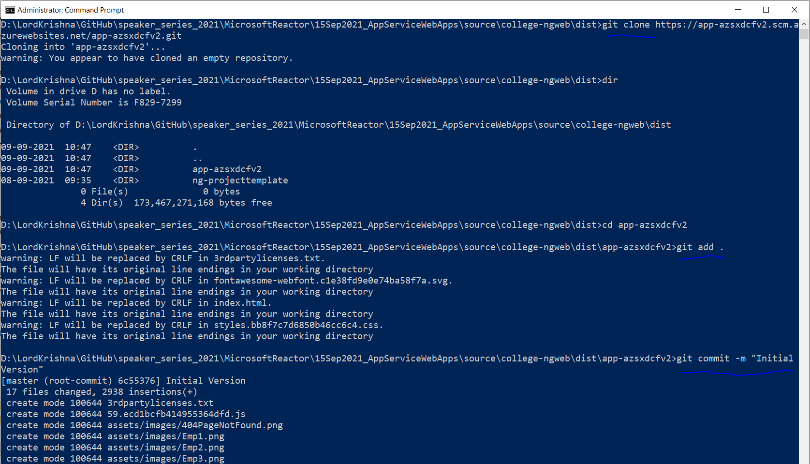
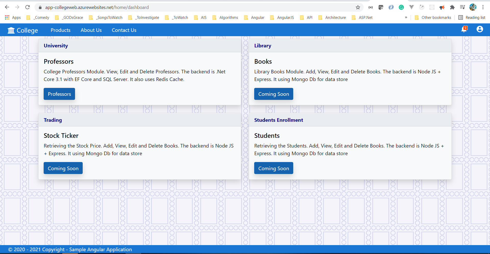

# Hands-on Creating Azure App Service Web Apps 15-Sep-2021 at 09:00 AM IST

## Event URL: [https://www.meetup.com/microsoft-reactor-bengaluru/events/280462794/](https://www.meetup.com/microsoft-reactor-bengaluru/events/280462794/) 


---


## Application Architecture Diagram 

NA

---

## Resources in Azure

```
rg-az204-webapps-reactor-001

app-collegeapi-win
plan-collegeapi-win

app-collegeapi-lnx
plan-collegeapi-lnx
```

## Information


## What are we doing today?
> 1. Introduction to Azure App Service
> 1. Creating Web App (Windows) in Portal, and deploying it from VS Code
> 1. Creating Web App (Linux), and deploying it from VS Code
> 1. Create a static HTML web app using `az webapp up`
> 1. Creating Web App (Angular 12), and deploying it using Azure CLI (Laptop) 
> 1. SUMMARY / RECAP / Q&A 


*****

## 1. Introduction to Azure App Service
> 1. App Service Overview
> 1. App Service Plans
> 1. Pricing Tiers
> 1. Ways to Deploy code to App Service
>    1. Manual
>    1. Automated

## 2. Creating Web App (Windows) in Portal, and deploying it from VS Code
> 1. Creating Web App (Windows) in Portal (`app-collegeapi-win`)
> 1. View the default `hostingstart.html` file
> 1. Modify the `hostingstart.html` file with ```<h1>Hello World !!</h1>```
> 1. Verify the output
> 1. Walk through simple Web API using .NET 5
> 1. Execute the below mentioned code to publish the binaries into a folder
> 1. Right Click on the **publish** folder.
> 1. Select *Deploy to Web App...* it from VS Code
> 1. Select the existing Web App which was created using Azure Portal
> 1. Navigate to `https://app-collegeapi-win.azurewebsites.net/weatherforecast` to view the output


```
dotnet publish -c release -o ./publish
```


## 3. Creating Web App (Linux), and deploying it from VS Code

**Note:** We do not have Shared plan in Linux Web Apps

> 1. Walk through simple Web API using .NET 5
> 1. Execute the below mentioned code to publish the binaries into a folder
> 1. Right Click on the **publish** folder.
> 1. Select *Deploy to Web App...* it from VS Code
> 1. Select the `+ Create new Web App... Advanced` option
> 1. Creating Web App (Linux) in Visual Studio Code (`app-collegeapi-lnx`)
> 1. Navigate to `https://app-collegeapi-lnx.azurewebsites.net/weatherforecast` to view the output
> 1. **SSH** into the **wwwroot** of the application to view the files

```
dotnet publish -c release -o ./publish

ls -a
```


## 4. Create a static HTML web app using `az webapp up`
> 1. Walk through of the Html App
> 1. Login using `az login`
> 1. Verify the account `az account show -o table`
> 1. Execute the `az webapp up`

URL: https://docs.microsoft.com/en-us/cli/azure/webapp?view=azure-cli-latest#az_webapp_up

```
az login

az account show -o table

az webapp list-runtimes

az webapp up --location EastUs --name hellohtml04092021 --resource-group rg-az204-webapps-reactor-001 --html
```


## 5. Creating Web App (Angular 12), and deploying it using Azure CLI (Laptop) 

**Note:** 
Please refer *NgWeb_WebApp.sh* from **infrastructure** folder.

> 1. Walk through of the **Angular 12** App
> 1. Login using `az login`
> 1. Verify the account `az account show`
> 1. Create App Service Plan, App Service Web App using the Azure CLI
> 1. Set `Local Git` as `Deployment` souce in `Azure CLI`
> 1. Execute `npm run build`
> 1. Execute `git clone https://app-azsxdcfv.scm.azurewebsites.net:443/app-azsxdcfv.git` inside **dist** folder
> 1. Copy the content from **dist/college-ngweb** to **dist/app-azsxdcfv**
> 1. Change Directory into **dist/app-azsxdcfv**
> 1. Execute `git add .` | `git commit -m "Initial Version` | `git push`
> 1. Browse the site



```
SUBSCRIPTION="SwamyPKV VSPS"
RESOURCEGROUP="rg-az204-webapps-reactor-001"
LOCATION="eastus"
PLANNAME="plan-azsxdcfv2"
PLANSKU="F1"
SITENAME="app-azsxdcfv2"

az login
az account show -o table
az account set --subscription $SUBSCRIPTION
az group create --name $RESOURCEGROUP --location $LOCATION

az appservice plan create --name $PLANNAME --location $LOCATION --sku $PLANSKU --resource-group $RESOURCEGROUP
az webapp create --name $SITENAME --plan $PLANNAME --resource-group $RESOURCEGROUP

az webapp deployment source config-local-git --name "app-azsxdcfv2" --resource-group "rg-az204-webapps-reactor-001"
git clone https://app-azsxdcfv2.scm.azurewebsites.net/app-azsxdcfv2.git

git add .
git commit -m "Initial Version
git push

# browse to the site
az webapp browse --name "app-azsxdcfv2" --resource-group "rg-az204-webapps-reactor-001"
```



## 6. SUMMARY / RECAP / Q&A 

*****
> 1. SUMMARY / RECAP / Q&A 
> 2. Any open queries, I will get back through meetup chat/twitter.
*****

## What is Next? (`Session 2` of `Azure App Services` on 29-Sep-2021)
> 1. Creating Web App, and deploying it using PowerShell
> 1. Creating Web App Azure CLI (Cloud Shell) and deploying using VS 2019
> 1. Creating the Web App using ARM template using cloud shell, and deploying using VS 2019
> 1. Creating Azure SQL Server and Database. Deploying .SQLPROJ to Azure SQL
> 1. Connecting Azure SQL from Local Web API
> 1. Deploying the Web API changes to Web App
> 1. Configuring the SQL Azure Connection String in App Settings in Azure
> 1. Verifying the Web API using Postman

