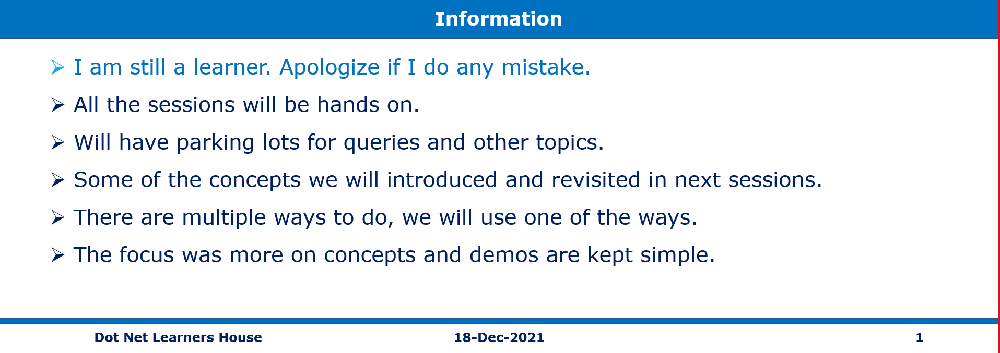

# Deploying .NET 6 Apps into Amazon EC2 (Ubuntu/Windows)

## Date Time: 18-Dec-2021 at 09:00 AM IST

## Event URL: [https://www.meetup.com/dot-net-learners-house-hyderabad/events/281836958](https://www.meetup.com/dot-net-learners-house-hyderabad/events/281836958)

## Youtube URL: [https://www.youtube.com/watch?v=FAgrCzShssY](https://www.youtube.com/watch?v=FAgrCzShssY)


---

## Application Architecture Diagram


---


## Information



## What are we doing today?

> 1. Introduction to Amazon EC2 - Discussion
> 1. Hands-On Deploying Ubuntu EC2
> 1. Hands-On Deploying Linux EC2
> 1. Hands-On Deploying Windows EC2
> 1. SUMMARY / RECAP / Q&A


---

## 1. Introduction to Amazon EC2 - Discussion
> 1. Amazon Machine Images (AMIs)
> 1. Instance types
> 1. Instance Purchasing Options
> 1. Security (Security Groups, Key Pairs, IAM Roles)
> 1. The VPC
> 1. Tags

**Note:**
Temporary storage volumes are provided, which are called Instance Store Volumes.  Data stored in this gets deleted once the instance is terminated. Persistent storage volumes are available and are referred to as EBS (Elastic Block Store) volumes.

---

## 2. Hands-On Deploying Ubuntu EC2 VM `ubuntu`
> 1. Discussion & Demo

### EC2 Instance Connect (browser-based SSH connection)
> 1. Demo

### Login Into Linux VM Using Browser


### Login using SSH in WSL2
> 1. Demo

```
ls -l
chmod 400 linuxvm1.pem
ssh -i "linuxvm1.pem" ec2-user@ec2-3-82-191-107.compute-1.amazonaws.com
```


### Setting `.pem` Key File Permission


### Login Into Linux VM Using SSH in WSL2


### DEMO 1 LAMP/Nginx Server

```
sudo apt update && sudo apt install -y lamp-server^
curl -I http://localhost
```

### Accessing the Apache  default page On Ubuntu VM


```
sudo apt-get -y update
sudo apt-get -y install nginx
curl -I http://localhost

```

---

## 3. Hands-On Deploying Linux EC2 VM `ec2-user`
> 1. Discussion & Demo

### Login using Windows SSH

```
icacls.exe linuxvm2.pem /reset
icacls.exe linuxvm2.pem /grant:r "PK.Viswanatha-Swamy:r"
icacls.exe linuxvm2.pem /inheritance:r
```
### Setting File Permission To ReadOnly on `Windows 10`


Reference: [https://gist.github.com/jaskiratr/cfacb332bfdff2f63f535db7efb6df93](https://gist.github.com/jaskiratr/cfacb332bfdff2f63f535db7efb6df93)


### Login Into Linux VM Using `SSH` on `Windows 10`


### Connect using `Putty` on `Windows 10`
> 1. Demo

### DEMO 2 Nginx Server

```
sudo yum -y update
sudo amazon-linux-extras install nginx1
curl -I http://localhost
sudo nginx
curl -I http://localhost
```

### Accessing the Nginx Server default page


---

## 4. Hands-On Deploying Windows EC2
> 1. Discussion and demo

### Retrieve Windows VM Password


### Retrieve Windows VM Password


### Login into Windows VM 


```
DISM /online /enable-feature /featureName:IIS-DefaultDocument /All
```

### IIS Installation Using DISM


### Access Default Page of IIS Default Document


```
PS > Install-WindowsFeature -name Web-Server -IncludeManagementTools
```

### IIS Installation Using PowerShell


### Access Default Page of IIS Default Document


## 4. SUMMARY / RECAP / Q&A

---

> 1. SUMMARY / RECAP / Q&A
> 2. Any open queries, I will get back through meetup chat/twitter.

---

## What is Next? 

**URL:** [https://www.meetup.com/dot-net-learners-house-hyderabad/events/281836958](https://www.meetup.com/dot-net-learners-house-hyderabad/events/281836958)

**Date:** `18-Dec-2021` at `10:00 AM IST`

> 1. VPC, Subnets
> 1. Availability Zones (AZs)
> 1. Regions
> 1. Edge Locations
> 1. Regional Edge Caches
> 1. Reboot the machine to show data loss
> 1. Deploying .NET Apps into Amazon EC2 Instances (Windows/Linux)
